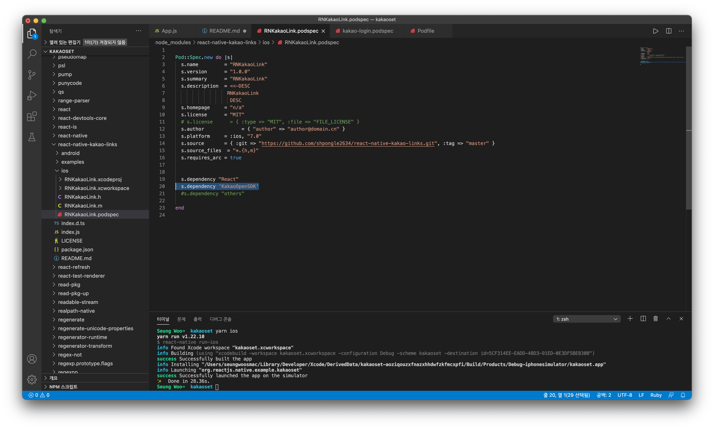

# Ios kakao login, kakao link usage

## Description

> ### dependencies
>
> > - [@react-native-seoul/kakao-login](https://github.com/react-native-seoul/react-native-kakao-login)
> > - [react-native-kakao-links](https://github.com/shpongle2634/react-native-kakao-links)
> > - Download
> >   > ```zsh
> >   > npm install --save @react-native-seoul/kakao-login
> >   > npm install --save react-native-kakao-links
> >   > ```
> >   >
> >   > **You have to modify podspec in react-native-kakao-links.**
>
> ### Set up
>
> > - Modify podspec in react-native-kakao-links module.
> >   > disannotate annotations this line in ./node-modules/react-native-kakao-links/ios/RNKakaoLink.podspec
> >   > <br>
> > - Pod install
> >   > ```zsh
> >   > cd ios && pod install && cd ..
> >   > ```
> > - Kakao developer
> >   > 1. generate new application
> >   > 2. enroll ios platform
> >   > 3. activate 'kakao login', 'send kakao message' in consented item
> >   > 4. remember 'native app key'
> > - Xcode project
> >   > 1. add URL Schemes
> >   >    > <br>
> >   > 2. add some lines in info.plist (projectname/projectname/info.plist)
> >   >    > <br>
> >   >    >
> >   >    > ```xml
> >   >    >  <key>KAKAO_APP_KEY</key>
> >   >    > 	<string>8d39dbc3601324824b58a56b791aeef6</string>
> >   >    >  <key>LSApplicationQueriesSchemes</key>
> >   >    >  <array>
> >   >    >    <string>kakao8d39dbc3601324824b58a56b791aeef6</string>
> >   >    >    <string>kakaokompassauth</string>
> >   >    >    <string>storykompassauth</string>
> >   >    >    <string>kakaolink</string>
> >   >    >    <string>kakaotalk-5.9.7</string>
> >   >    >    <string>storylink</string>
> >   >    >  </array>
> >   >    > ```
> >   >    >
> >   >    > these app key is not a valid key.<br>
> >   >    > use your app key.
> >   > 3. add some codes in AppDelegate.m
> >   >    > <br>
> >   >    >
> >   >    > ```objective-c
> >   >    >  #import <KakaoOpenSDK/KakaoOpenSDK.h>
> >   >    >  ...
> >   >    >  @implementation AppDelegate
> >   >    >  - (BOOL)application:(UIApplication *)application openURL:(NSURL *)url sourceApplication:(NSString *)sourceApplication annotation:(id)annotation {
> >   >    >      if ([KOSession isKakaoAccountLoginCallback:url]) {
> >   >    >          return [KOSession handleOpenURL:url];
> >   >    >      }
> >   >    >      return false;
> >   >    >  }
> >   >    >  - (BOOL)application:(UIApplication *)application openURL:(NSURL *)url options: (NSDictionary<NSString *,id> *)options {
> >   >    >      if ([KOSession isKakaoAccountLoginCallback:url]) {
> >   >    >          return [KOSession handleOpenURL:url];
> >   >    >      }
> >   >    >      return false;
> >   >    >  }
> >   >    >  - (void)applicationDidBecomeActive:(UIApplication *)application {
> >   >    >      [KOSession handleDidBecomeActive];
> >   >    >  }
> >   >    >  ...
> >   >    > ```
